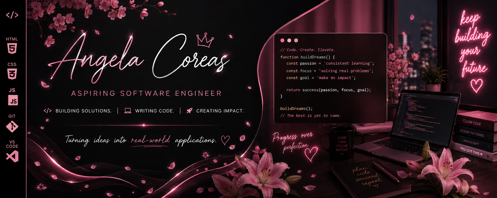
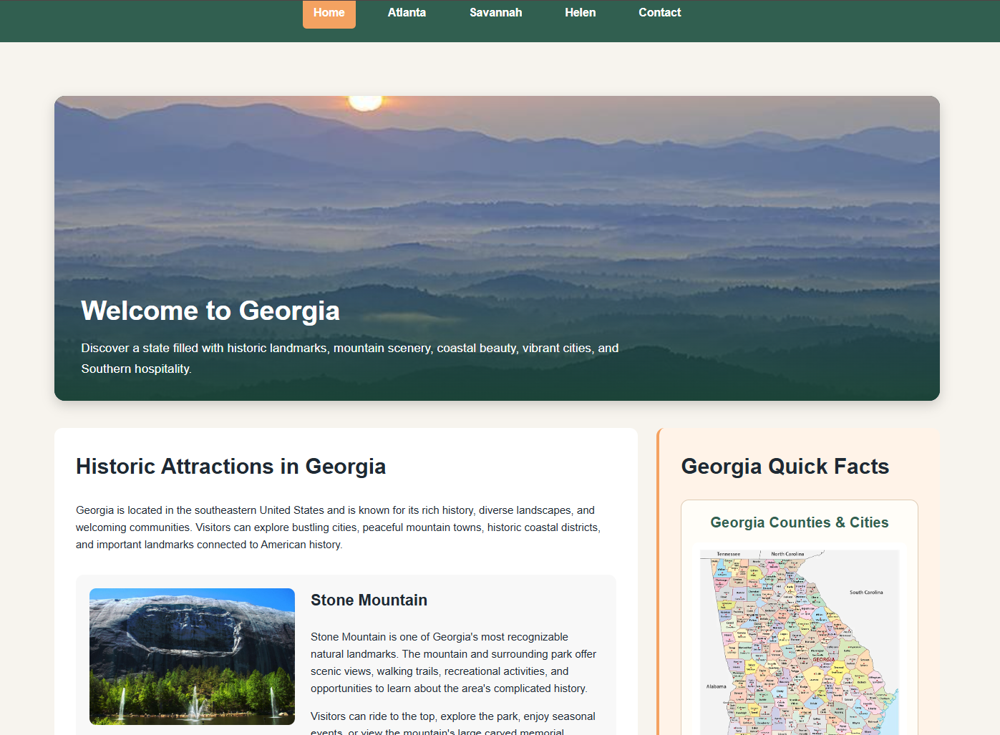
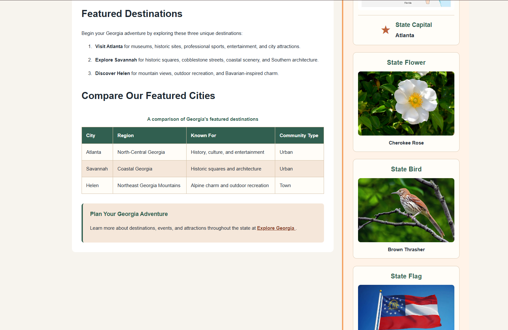

  

<h1 align="center">✦ Discovering Georgia Tourism Website ✦</h1>

  <b>Responsive Multi-Page Website • WGU Excellence Award Recipient</b>

A responsive tourism website designed to help visitors explore Georgia’s history, culture, landmarks, and featured destinations.

 

  
  
  

 

  

  

  

  

---

## ✦ PROJECT PREVIEW ✦

### Discovering Georgia Homepage

The homepage introduces visitors to Georgia through clear navigation, featured destinations, historical information, and state facts.

### Featured Destinations and State Information

This section uses a structured comparison table and supporting visual content to help visitors learn about Atlanta, Savannah, Helen, and Georgia’s state symbols.

---

## ✦ PROJECT OVERVIEW ✦

Discovering Georgia is a responsive, multi-page tourism website developed for WGU’s Front-End Web Development course.

The website introduces visitors to Georgia’s history, culture, natural scenery, and popular destinations. It includes dedicated pages for Atlanta, Savannah, and Helen, along with state facts and a contact page.

This project demonstrates semantic HTML, CSS styling, responsive layouts, navigation design, information hierarchy, tables, forms, and accessible content organization.

---

## ✦ WGU EXCELLENCE AWARD ✦

This project received a **WGU Excellence Award** after evaluation faculty recognized the exceptional quality of the submitted work.

The evaluator specifically praised the low-level layouts for being clean, readable, and clearly identifying the required page elements.

This recognition reflects the project’s thoughtful planning, visual organization, and attention to user-friendly page structure.

---

## ✦ PROJECT PURPOSE ✦

The goal of this project was to design and develop an informative state tourism website with a consistent visual identity and clear navigation across multiple pages.

The website was created to help users:

✦ Learn about Georgia’s history and culture

✦ Explore popular destinations

✦ Compare featured cities

✦ Discover state facts and symbols

✦ Navigate between related pages easily

✦ Access organized tourism information

---

## ✦ WEBSITE PAGES ✦

### Home

Introduces visitors to Georgia and presents featured destinations, state facts, and general tourism information.

### Atlanta

Highlights Atlanta’s attractions, history, entertainment, and urban experiences.

### Savannah

Explores Savannah’s historic squares, architecture, coastal scenery, and Southern culture.

### Helen

Features Helen’s mountain setting, Bavarian-inspired design, recreation, and seasonal attractions.

### Contact

Provides visitors with a structured way to submit questions or request additional information.

---

## ✦ KEY FEATURES ✦

✦ Responsive multi-page design

✦ Consistent navigation across all pages

✦ Semantic HTML structure

✦ Custom CSS styling

✦ Georgia-inspired color palette

✦ Featured destination content

✦ City comparison table

✦ State facts and symbols

✦ Organized image presentation

✦ External tourism resources

✦ Contact form interface

✦ Desktop and mobile-friendly layouts

---

## ✦ TECH STACK ✦

  

HTML5 • CSS3 • Responsive Design • Git • GitHub • VS Code

---

## ✦ DESIGN PROCESS ✦

### Layout Planning

Low-level layouts were created to establish the structure, content placement, and required elements for each page before development began.

### Information Architecture

Content was divided into dedicated pages so visitors could move easily between the homepage and featured destinations.

### Visual Design

A Georgia-inspired color palette, consistent typography, card layouts, images, tables, and spacing were used to create a cohesive presentation.

### Responsive Development

CSS layout techniques were applied to support readability and usability across different screen sizes.

### Testing and Refinement

Navigation, layout consistency, content placement, links, and form elements were reviewed throughout development.

---

## ✦ SKILLS DEMONSTRATED ✦

✦ Semantic HTML5

✦ CSS3 Styling

✦ Responsive Web Design

✦ Multi-Page Website Development

✦ User Interface Design

✦ User Experience Principles

✦ Information Architecture

✦ Low-Level Layout Planning

✦ Navigation Design

✦ Table Design

✦ Form Structure

✦ Visual Hierarchy

✦ Content Organization

✦ Accessibility Awareness

✦ Git Version Control

✦ GitHub Project Documentation

---

## ✦ WHAT I LEARNED ✦

✦ How to plan a website before beginning development

✦ How to translate low-level layouts into working web pages

✦ How to maintain consistent navigation and styling across multiple pages

✦ How to organize information according to user needs

✦ How to build structured tables and forms with HTML

✦ How to create reusable CSS styles

✦ How to improve readability through spacing and visual hierarchy

✦ How to design layouts for different screen sizes

✦ How to document a technical project for a professional portfolio

---

## ✦ FUTURE ENHANCEMENTS ✦

✦ Add interactive JavaScript features

✦ Add destination search and filtering

✦ Include an interactive Georgia map

✦ Add additional Georgia cities and attractions

✦ Improve form validation

✦ Add event and travel-planning information

✦ Expand accessibility testing

✦ Add image galleries for each destination

✦ Deploy a public demonstration version

---

## ✦ PROJECT ACCESS ✦

This repository is a public showcase containing project documentation and screenshots of the completed website.

The complete source code is maintained privately because the website was developed as part of an academic performance assessment.

Course instructions, assessment materials, grading documentation, evaluator correspondence, and complete submission files are not included in this repository.

---

## ✦ SHOWCASE STRUCTURE ✦

    georgia-tourism-website-showcase/
    ├── assets/
    │   ├── angela-coreas-banner.png
    │   ├── georgia-tourism-preview.png
    │   └── georgia-tourism-features.png
    └── README.md

---

## ✦ AUTHOR ✦

**Angela Coreas**

Software Engineering Student • Operations & CRM Professional

**LinkedIn:**  
https://www.linkedin.com/in/angela-coreas-550088186/

**GitHub:**  
https://github.com/angelacoreas1989-boop

**Portfolio:**  
https://angelacoreas1989-boop.github.io/tech-portfolio/

**Email:**  
acorea3@wgu.edu

---

  ✦ Building Solutions • Writing Code • Creating Impact ✦

  <i>💗 Building consistently. Learning intentionally. Creating real-world solutions. 💗</i>

  ✦

